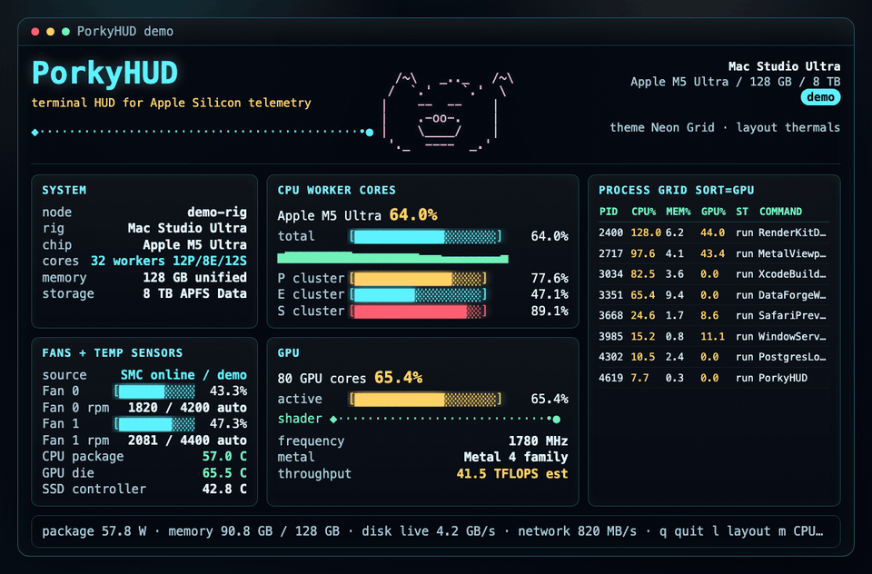

# PorkyHUD

PorkyHUD is a portable, dependency free macOS terminal dashboard for system status.

<p align="center">
  
</p>

<p align="center">
  <sub>Demo profile.</sub>
</p>

## Install

Homebrew:

```bash
brew tap Mengjiehasaheart/porkyhud
brew install porkyhud
porkyhud
```

One-command install:

```bash
brew install Mengjiehasaheart/porkyhud/porkyhud
```

Optional one-time advanced sensor setup:

```bash
porkyhud --setup-sensors
```

This asks for an administrator password once and installs `/etc/sudoers.d/porkyhud`, allowing admin users to run only the bounded `powermetrics` sample commands PorkyHUD uses. After that, normal launches can read advanced CPU/GPU power and residency data without another sensor password prompt.

To check or remove it:

```bash
porkyhud --sensor-access-status
porkyhud --remove-sensor-access
```

From a checkout:

Double-click:

```text
PorkyHUD.command
```

From Terminal:

```bash
./PorkyHUD.command
```

The launcher and curses app explicitly set a dark terminal background so every theme remains legible even when Terminal is normally using a light profile.

## Keyboard Shortcuts

| Key | Action |
| --- | --- |
| `h` or `?` | Show or hide shortcut help |
| `t` | Cycle visual theme |
| `l` | Cycle terminal layout: balanced, compute, thermals, I/O, processes, compact, cinema |
| `a` | Cycle animation mode: off, calm, vivid |
| `u` | Retry advanced sensor unlock with `sudo` |
| `m` | Cycle process sort by CPU, memory, or GPU |
| `r` | Rescan system and sensor state |
| `Up` / `Down` or `j` / `k` | Scroll process list |
| `PageUp` / `PageDown` | Fast scroll process list |
| `q` or `Esc` | Quit |

## Snapshot Mode

For packaging, debugging, and future GUI integration:

```bash
./porkyhud.py --snapshot
./porkyhud.py --json
```

## macOS Sensor Access

Most PorkyHUD data is available to a normal user account. PorkyHUD reads AppleSMC directly for read-only fan RPM and temperature keys when macOS exposes them. Modern macOS still protects deeper CPU/GPU power, die temperature, and active residency counters behind administrator-only tools such as `powermetrics`.

PorkyHUD handles this in two ways:

- Run `porkyhud --setup-sensors` once to install a narrow passwordless `powermetrics` rule for future launches.
- Inside the dashboard, press `u` to try a temporary sudo session unlock without installing the rule.

If admin access has not been granted, PorkyHUD shows one unlock hint. If admin access is available but the Mac model still does not publish a value, PorkyHUD hides that field instead of inventing a reading.

## Metric Notes

- RAM follows the Activity Monitor-style split: app + wired + compressed count as used, while file-backed cache is shown separately as available cache.
- Disk usage reports the writable APFS Data volume on modern macOS instead of the sealed read-only system volume.
- Disk activity is sampled from `iostat` on a background cadence so it does not freeze the terminal UI.
- CPU workers are logical cores sampled through macOS Mach host CPU counters.
- Apple Silicon core labels use IORegistry topology with `hw.perflevel*` cross-checks, including M-series Performance/Super layouts.
- Fan RPM and grouped temperature sensors use the same read-only SMC key model as the reference Mac app, with a dedicated thermal layout for quick inspection.
- Process GPU attribution uses AGX `accumulatedGPUTime` deltas when macOS exposes them.
- The bottom `read:` line turns the current signals into one plain sentence without expanding the layout.
- CPU, RAM, network, and disk panels include compact 60-second sparklines.
- Apple Silicon CPU workers are grouped by reported Performance, Efficiency, and Super clusters when macOS exposes the data.

## Requirements

- macOS
- Python 3 available as `python3`
- No Python packages required


```bash
chmod +x PorkyHUD.command porkyhud.py
```

<p align="center">
  <sub><em>Visit <a href="https://drmatchastudio.com">DMS</a>.</em></sub>
</p>
